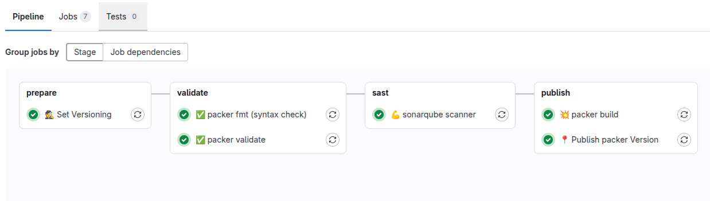

---
date:
    created: 2025-04-25
authors:
    - maciej-rachuna
title: PACKER - template vm na proxmox - alpine
categories:
    - packer
tags:
    - packer
---

# {height=20px} PACKER - template vm na proxmox - alpine

Dziś pokażę, jak utworzyć template wirtualnej maszyny na proxmox za pomocą packera

!!! question "Czemu tworzymy template maszyny wirtualnej?"
    Tworzenie template'u maszyny wirtualnej na Proxmox za pomocą Packer ma wiele zalet, zwłaszcza w kontekście automatyzacji i zarządzania infrastrukturą jako kodem (IaC). Oto kluczowe powody, dla których warto to robić:

      - Automatyzacja i Powtarzalność
      - Standaryzacja Środowiska
      - Łatwa Integracja z Terraform
      - Bezpieczeństwo i Aktualizacje
      - Optymalizacja Zasobów
      - Łatwiejsza Skalowalność
      - Integracja z CI/CD

<!-- more -->
### Struktura repozytorium
``` bash
.
├── build.pkr.hcl                            # hardening maszyny wirtualnej
├── file_source.pkr.hcl                      # definicja generowania plików
├── http
├── iso
├── locals.pkr.hcl                           # zmienne lokalne
├── pkrvars
│   ├── alpine-3.19-amd64.pkrvars.hcl        # definicja template
│   ├── alpine-3.20-amd64.pkrvars.hcl
│   └── alpine-3.21-amd64.pkrvars.hcl
├── provider.pkr.hcl                         # definicja providera
├── template.pkr.hcl                         # definicja template virtualnej maszyny
├── templates                                # szablony plików
│   ├── alpine-setup.sh.pkrtpl               
│   └── answers.pkrtpl
├── variables_cloud_init.pkr.hcl             # definicja zmiennych 
├── variables_http.pkr.hcl
├── variables_iso.pkr.hcl
├── variables.pkr.hcl
├── variables_proxmox.pkr.hcl
├── variables_ssh.pkr.hcl
└── variables_vm.pkr.hcl
```

## build.pkr.hcl

Plik **`build.pkr.hcl`** definiuje proces budowy obrazu **Alpine Linux** dla **Proxmox VE** z wykorzystaniem **Packer**, który zawiera
✅ Instalację systemu i pakietów (`apk add`).  
✅ Konfigurację Cloud-Init (`setup-cloud-init`).  
✅ Zabezpieczenie dostępu (`root` wyłączony, SSH klucze usunięte).  
✅ Czyszczenie zbędnych plików (historia, SSH, setup script).

To podejście sprawia, że obraz Alpine jest **gotowy do automatycznego wdrożenia** na Proxmox z **Cloud-Init**, a także **zabezpieczony** przed potencjalnymi podatnościami. 🚀

## file_source.pkr.hcl

Plik **`file_source.pkr.hcl`** definiuje generowanie plików, które są używane w procesie instalacji systemu. W Twoim przypadku mamy dwa źródła plików (answers i setup), które są generowane dynamicznie na podstawie zmiennych Packer.

### Answers

Plik `answers` to prawdopodobnie plik odpowiedzi dla automatycznego instalatora Alpine (setup-alpine). Dzięki temu instalacja systemu odbywa się bez interakcji użytkownika, co jest kluczowe w automatyzacji.


### alpine-setup.sh
Plik `alpine-setup.sh` przygotowuje maszynę do pierwszego użycia. Instaluje niezbędne pakiety, konfiguruje serwer ssh, tak aby można było się do niego podłączyć zaraz po uruchomieniu.

## template.pkr.hcl
Plik `template.pkr.hcl` opisuje sposób tworzenai szablonu maszyny wirtualnej **Alpine Linux** na **Proxmox VE**

- Łączy się z serwerem Proxmox przez API i tworzy nową maszynę w puli templates.
- Konfiguruje sprzęt VM – liczbę rdzeni, pamięć RAM, interfejsy sieciowe (VLAN 10 dla testów, 20 dla produkcji) oraz dysk (scsi na storage.rachuna-net.pl).
- Uruchamia instalację Alpine Linux z plikiem odpowiedzi (answers) oraz wykonuje skrypt post-instalacyjny (alpine-setup.sh).
- Włącza Cloud-Init, umożliwiając automatyczne dostosowanie konfiguracji VM po wdrożeniu.
- Konfiguruje dostęp SSH – używa klucza prywatnego lub hasła i wykonuje do 100 prób nawiązania połączenia.

## Uruchamiamy kod

!!! tips inline
    Musisz mieć zainstalowany `packer` od hashicorp

```bash
#!/bin/bash

#### PROXMOX CLUSTER VARIABLES ####
export PKR_VAR_proxmox_node_name="pve"
export PKR_VAR_proxmox_api_username="root@pam"
export PKR_VAR_proxmox_api_password="<< twoje tajne hasło >>"
export PKR_VAR_proxmox_api_tls_verify="false"

### ISO VARIABLES ###
export PKR_VAR_iso_storage_pool="local"

### VM VARIABLES ###
# Możesz ustawić konkretny vm_id. Puste oznacza następny id liczony od 100
# export PKR_VAR_vm_id=

export PKR_VAR_ssh_public_key="<< Klucz publiczny SSH dla połączenia się do maszyny >>"
export PKR_VAR_ssh_private_key_file="<< Ścieżka gdzie znajduje się klucz prywatny do połączenia się z maszyną vm za pomocą SSH >>"
export PKR_VAR_root_password="<< tajne hasło roota >>"

# Wyszkujemy w katalogu pkrvars wszystkie definicje maszyn wirtualnych i je uruchamiamy
for file in $(find pkrvars -type f -name "*.hcl"); do
    packer fmt -check -var-file=$file .   # walidacja pod kątem formatowania
    packer validate -var-file=$file .     # walidacja pod kątem semantyki
    packer build -var-file=$file .        # Odpalamy proces
done
```
## Integracja z gitlab-ci
Utworzyłem proces-ci dla `packer`, który wygląda tak:



# Podziękowania
Swoją inspirację zawdzięczam repetytorowi [sdhibit/packer-proxmox-templates](https://github.com/sdhibit/packer-proxmox-templates)