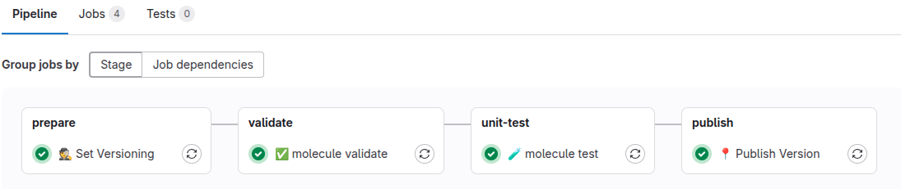

# {width=20px} Testowanie roli Ansible z użyciem vm proxmox

!!! note
    **Molecule**[^molecule] to framework umożliwiający automatyczne testowanie ról Ansible w odizolowanych środowiskach. W integracji z **Proxmox** pozwala na dynamiczne tworzenie maszyn wirtualnych na podstawie istniejących szablonów (**VM Templates**), uruchamianie roli Ansible, a następnie walidację jej działania.  

Proces testowania obejmuje:  
1. **Klonowanie nowej VM** na serwerze Proxmox z predefiniowanego szablonu.  
2. **Provisioning** – uruchomienie roli Ansible i konfiguracja systemu.  
3. **Weryfikację poprawności konfiguracji** za pomocą testów Ansible lub Testinfra.  
4. **Usunięcie instancji** po zakończeniu testów, aby nie pozostawiać zbędnych zasobów.  

Dzięki temu testowanie ról Ansible w Proxmox jest szybkie, powtarzalne i zautomatyzowane, co pozwala na wykrywanie błędów jeszcze przed wdrożeniem na produkcję. 🚀


## Architektura rozwiązania
--8<-- "docs/projects/ansible/images/architektura-test-role.drawio.html"


## Przygotowanie środowiska
```bash
python3 -m venv ~/.venvs/molecule
source ~/.venvs/molecule/bin/activate
pip install --upgrade pip

pip3 install ansible-core molecule molecule-proxmox pytest-testinfra ansible-lint molecule-plugins requests testinfra
```

[^molecule]: Źródło: [https://ansible.readthedocs.io/projects/molecule/](https://ansible.readthedocs.io/projects/molecule/)


## Utworzenie projektu molecule
```bash
molecule init role nazwa_roli
```

## Konfiguracja molecule z pluginem **Molecule Proxmox Plugin**[^plugin]

```yml
driver:
  name: molecule-proxmox
  options:
    debug: true
    # api_host:                       # from env TEST_PROXMOX_HOST
    # api_user:                       # from env TEST_PROXMOX_USER
    # api_password:                   # from env TEST_PROXMOX_PASSWORD 
    # node:                           # from env TEST_PROXMOX_NODE
    ssh_user: ansible
    ssh_port: 22
    ssh_identity_file: /tmp/molecule
    timeout: 3600

platforms:
  - name: molecule-ubuntu
    template_name: ubuntu-24.10
    # vmid: 103
    full: false
    pool: molecule
    ciuser: ansible
    cipassword: "ansible"
    net:
      net0: 'virtio,bridge=vmbr0,tag=10'
    ipconfig:
      ipconfig0: "ip=dhcp"
    core: 1
    cpu: 1
    memory: 2048

provisioner:
  name: ansible
  env:
    ANSIBLE_ROLES_PATH: ../../../../roles/
  config_options:
    ssh-connection:
      host_key_checking: false

verifier:
  name: testinfra
  options:
    v: true
```

## Zmiany w playbookach defaultowych

Kopiowanie defaultowego playbooka do projektu molecule
```bash
cp ~/.venvs/molecule/lib/python3.12/site-packages/molecule_proxmox/playbooks/create.yml molecule/default/create.yml
```
Edycja playboka
```yml
(...)
    - name: "Create molecule instance(s)."
      community.general.proxmox_kvm:
        state: present
        {--api_host: "{{ api_host | d(options.api_host) | d(omit) }}"--}
        {++api_host: "{{ api_host | d(options.api_host) | d(lookup('env', 'TEST_PROXMOX_HOST')) | d(omit) }}"++}
        {--api_user: "{{ api_user | d(options.api_user) | d(omit) }}"--}
        {++api_user: "{{ api_user | d(options.api_user) | d(lookup('env', 'TEST_PROXMOX_USER')) | d(omit) }}"++}
        {--api_password: "{{ api_password | d(options.api_password) | d(omit) }}"--}
        {++api_password: "{{ api_password | d(options.api_password) | d(lookup('env', 'TEST_PROXMOX_PASSWORD')) | d(omit) }}"++}
        {++# Dodanie obsługi za pomocą portu++}
        {++api_port: "{{ api_port | d(options.api_port) | d(lookup('env', 'TEST_PROXMOX_PORT') | int) | d(omit) }}"++}
        api_token_id: "{{ api_token_id | d(options.api_token_id) | d(omit) }}"
        api_token_secret: "{{ api_token_secret | d(options.api_token_secret) | d(omit) }}"
        vmid: "{{ p.proxmox_template_vmid | d(p.template_vmid, true) | d(omit, true) }}"
        clone: "{{ p.proxmox_template_name | d(p.template_name, true) | d(options.template_name, true) | d(p.box, true) | d('molecule', true) }}"
        name: "{{ p.name }}"
        {--node: "{{ options.node }}"--}
        {++node: "{{ options.node | d(lookup('env', 'TEST_PROXMOX_NODE'))  }}"++}
        timeout: "{{ options.timeout | d(omit) }}"
        (...)

    - name: "Update molecule instance config(s)"
      community.general.proxmox_kvm:
        state: present
        update: true
        {--api_host: "{{ api_host | d(options.api_host) | d(omit) }}"--}
        {++api_host: "{{ api_host | d(options.api_host) | d(lookup('env', 'TEST_PROXMOX_HOST')) | d(omit) }}"++}
        {--api_user: "{{ api_user | d(options.api_user) | d(omit) }}"--}
        {++api_user: "{{ api_user | d(options.api_user) | d(lookup('env', 'TEST_PROXMOX_USER')) | d(omit) }}"++}
        {--api_password: "{{ api_password | d(options.api_password) | d(omit) }}"--}
        {++api_password: "{{ api_password | d(options.api_password) | d(lookup('env', 'TEST_PROXMOX_PASSWORD')) | d(omit) }}"++}
        {++# Dodanie obsługi za pomocą portu++}
        {++api_port: "{{ api_port | d(options.api_port) | d(lookup('env', 'TEST_PROXMOX_PORT') | int) | d(omit) }}"++}
        api_token_id: "{{ api_token_id | d(options.api_token_id) | d(omit) }}"
        api_token_secret: "{{ api_token_secret | d(options.api_token_secret) | d(omit) }}"
        vmid: "{{ rc.vmid }}"
        {--node: "{{ options.node }}"--}
        {++node: "{{ options.node | d(lookup('env', 'TEST_PROXMOX_NODE'))  }}"++}
        timeout: "{{ options.timeout | d(omit) }}"
        ciuser: "{{ rc.p.ciuser | d(omit, true) }}"
        {++ # W celu przyszpieszenia stawiania vm, nie chce klonować dysku++}
        {++full: "{{ p.full | d(options.full) | d(omit) }}"++}
        (...)
        {--sshkeys: "{{ rc.p.sshkeys | d(omit, true) }}"--}
        {++sshkeys: "{{ rc.p.sshkeys | d(lookup('env', 'TEST_SSH_PUB_KEY')) | d(omit, true) }}"++}
        (...)

    - name: "Start molecule instance(s)."
      proxmox_qemu_agent:
        {--api_host: "{{ api_host | d(options.api_host) | d(omit) }}"--}
        {++api_host: "{{ api_host | d(options.api_host) | d(lookup('env', 'TEST_PROXMOX_HOST')) | d(omit) }}"++}
        {--api_user: "{{ api_user | d(options.api_user) | d(omit) }}"--}
        {++api_user: "{{ api_user | d(options.api_user) | d(lookup('env', 'TEST_PROXMOX_USER')) | d(omit) }}"++}
        {--api_password: "{{ api_password | d(options.api_password) | d(omit) }}"--}
        {++api_password: "{{ api_password | d(options.api_password) | d(lookup('env', 'TEST_PROXMOX_PASSWORD')) | d(omit) }}"++}
        {++# Dodanie obsługi za pomocą portu++}
        {++api_port: "{{ api_port | d(options.api_port) | d(lookup('env', 'TEST_PROXMOX_PORT') | int) | d(omit) }}"++}
        api_token_id: "{{ api_token_id | d(options.api_token_id) | d(omit) }}"
        api_token_secret: "{{ api_token_secret | d(options.api_token_secret) | d(omit) }}"
        vmid: "{{ rc.vmid }}"
        {--node: "{{ options.node }}"--}
        {++node: "{{ options.node | d(lookup('env', 'TEST_PROXMOX_NODE'))  }}"++}
        (...)
(...)
```
Oryginalny playbook znajduje się ~/.venvs/molecule/lib/python3.12/site-packages/molecule_proxmox/playbooks/destroy.yml
```bash
cp ~/.venvs/molecule/lib/python3.12/site-packages/molecule_proxmox/playbooks/destroy.yml molecule/default/destroy.yml
```

```yml
- name: Destroy
(...)
    - name: "Remove molecule instance(s)."
      community.general.proxmox_kvm:
        {--api_host: "{{ api_host | d(options.api_host) | d(omit) }}"--}
        {++api_host: "{{ api_host | d(options.api_host) | d(lookup('env', 'TEST_PROXMOX_HOST')) | d(omit) }}"++}
        {--api_user: "{{ api_user | d(options.api_user) | d(omit) }}"--}
        {++api_user: "{{ api_user | d(options.api_user) | d(lookup('env', 'TEST_PROXMOX_USER')) | d(omit) }}"++}
        {--api_password: "{{ api_password | d(options.api_password) | d(omit) }}"--}
        {++api_password: "{{ api_password | d(options.api_password) | d(lookup('env', 'TEST_PROXMOX_PASSWORD')) | d(omit) }}"++}
        {++# Dodanie obsługi za pomocą portu++}
        api_token_id: "{{ api_token_id | d(options.api_token_id) | d(omit) }}"
        api_token_secret: "{{ api_token_secret | d(options.api_token_secret) | d(omit) }}"
        {--node: "{{ options.node }}"--}
        {++node: "{{ options.node | d(lookup('env', 'TEST_PROXMOX_NODE'))  }}"++}
        state: absent
        (...)
```
## Skrypt uruchamiający testowanie
```bash
export TEST_PROXMOX_DEBUG="true"
export TEST_PROXMOX_HOST="<<pve>>"
export TEST_PROXMOX_PORT="8006"
export TEST_PROXMOX_USER="root@pam"
export TEST_PROXMOX_PASSWORD="<<password>>"
export TEST_PROXMOX_NODE="<<node>>"
export TEST_SSH_PUB_KEY="<<ssh_pub_key>>"

molecule test

# molecule create
# molecule converge
# molecule verify
# molecule destroy
```

### Przykładowy przebieg procesu w Gitlab-Ci


[^plugin]: Źródło: [https://github.com/meffie/molecule-proxmox](https://github.com/meffie/molecule-proxmox)