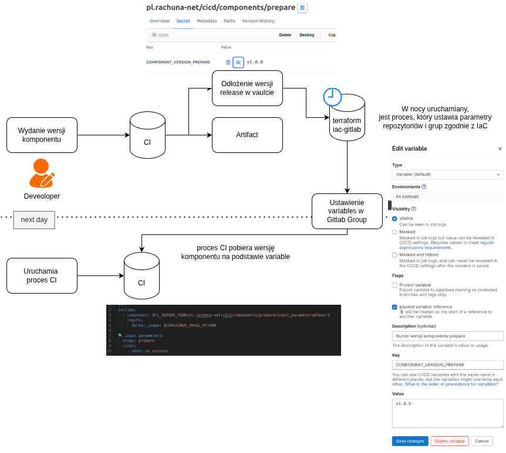

# 🔁 Automatyczne ustawianie wersji komponentów w GitLab CI z wykorzystaniem sekretów i Terraform



!!! notes
    W wielu organizacjach zespoły DevOps publikują dziesiątki komponentów dziennie. Wyzwaniem staje się automatyczne *propagowanie* wersji tych komponentów do innych pipeline’ów – tak, aby kolejnego dnia zespół developerski miał dostęp do najnowszych, gotowych do użycia artefaktów.

    Poniżej opisuję prosty, ale bardzo efektywny mechanizm oparty na:

    * GitLab CI,
    * GitLab Secret Variables (via API),
    * oraz Terraform (z cron-triggerem).


## 🧠 Koncepcja

1. **Każdy komponent** po wypuszczeniu wersji (np. `v1.2.3`) w branchu `main` zapisuje ten numer wersji jako **sekret** w na vault.
2. **Centralny pipeline iac-gitlab**, odpalany raz na dobę (np. w nocy), zaczytuje te sekrety i aktualizuje zmienne środowiskowe na poziomie grupy lub projektu (np. `COMPONENT_VERSION_DEPLOY`).
3. Dzięki temu **każdy pipeline następnego dnia wie**, jakiej wersji komponentu powinien używać.

## 🏗️ Architektura

```plaintext
[component-X repo]
└─ GitLab CI (main branch only)
   └─ writes tag version → secret:
      pl.rachuna-net/cicd/components/deploy:COMPONENT_VERSION_DEPLOY

[scheduler repo]
└─ Daily pipeline
   └─ uses Terraform to:
       └─ read secrets
       └─ update GitLab group variables
```

---
## ⚙️ Krok po kroku

### 1. Komponent odkłada wersję w sekrecie

W `.gitlab-ci.yml` komponentu (trigger tylko na `main`):

```yaml
# PUBLISH_VAULT_SECRET_PATH zdefiniowane w variable projektu (eg. pl.rachuna-net/cicd/components/deploy:COMPONENT_VERSION_DEPLOY)
# PUBLISH_VAULT_VALUE_VARIABLE_NAME zdefiniowane w variable projektu (eg. RELEASE_CANDIDATE_TAG)
deploy_version:
  stage: deploy
  image: $CONTAINER_IMAGE_VAULT
  rules:
    - if: '$CI_COMMIT_BRANCH == $CI_DEFAULT_BRANCH && $PUBLISH_VAULT_SECRET_PATH != null && $PUBLISH_VAULT_SECRET_PATH != ""'
      when: on_success
    - when: never
  script:
    - |
      echo ""
      echo -e "\033[1;33m===>\033[0m 🎉 Publish version in vault"
      IFS=":" read -r path secret <<< "$PUBLISH_VAULT_SECRET_PATH"
      vault kv patch -mount=$PUBLISH_MOUNT_PATH $path $secret="${!PUBLISH_VAULT_VALUE_VARIABLE_NAME}"
      echo -e "  👍 Publish version in vault success"
```

---
### 2. Nocny pipeline odpala Terraform

Repozytorium `cicd/components/deploy` zawiera manifest Terraform:

```hcl
data "vault_kv_secret_v2" "gitlab_pl-rachuna-net_cicd_components_prepare" {
  mount = "kv-gitlab"
  name  = "pl.rachuna-net/cicd/components/prepare"
}

module "_pl_rachuna-net" {
  source = "git@gitlab.com:pl.rachuna-net/infrastructure/terraform/modules/gitlab-group.git?ref=v1.1.0"

  name           = "pl.rachuna-net"
  description    = "https://rachuna-net.pl"
  parent_group   = "" # Brak grupy nadrzędnej
  visibility     = "public"
  default_branch = "main"
  labels         = jsondecode(file("${path.module}/data/labels.json"))
  icon_type      = "root"

  badges = jsondecode(file("${path.module}/data/group_badges.json"))
  variables = {
    (...)
    COMPONENT_VERSION_PREPARE = {
      description = "Numer wersji komponentu prepare"
      value       = data.vault_kv_secret_v2.gitlab_pl-rachuna-net_cicd_components_prepare.data["COMPONENT_VERSION_PREPARE"]
    }
    (...)
  }
}

module "pl-rachuna-net" {
  source = "./pl.rachuna-net/"
}
```


### 3. Pipeline’y korzystają ze zmiennej grupowej

Dowolny inny projekt (np. konsument komponentu) może używać:

```yaml
---
include:
  - local: _rules/release.yml
  - component: $CI_SERVER_FQDN/pl.rachuna-net/cicd/components/release/versioning@$COMPONENT_VERSION_RELEASE
    inputs:
      docker_image: $CONTAINER_IMAGE_SEMANTIC_RELEASE

  - component: $CI_SERVER_FQDN/pl.rachuna-net/cicd/components/release/vault@$COMPONENT_VERSION_RELEASE
    inputs:
      docker_image: $CONTAINER_IMAGE_VAULT

🕵 Set Version:
  stage: prepare
  rules:
    - when: on_success

📍 Publish Version:
  stage: release
  rules:
    - when: on_success

🎉 Publish version in vault:
  stage: release
  needs:
    - job: 🕵 Set Version
    - job: 🌐 publish docker image
      optional: true
  variables:
    PUBLISH_VAULT_VALUE_VARIABLES_NAME: "$PUBLISH_VAULT_VALUE_VARIABLE"
  rules: !reference [.rule:release:vault, rules]
```

---
## ✅ Zalety

* 🔄 **Automatyzacja propagacji** wersji bez ręcznej synchronizacji
* 🧩 **Integracja z Terraformem** umożliwia łatwe rozbudowanie o kolejne komponenty
* 🔐 **Centralizacja wersji** przez zmienne grupowe i sekrety
* 🕒 **Codzienna aktualizacja**, dzięki czemu deweloperzy zawsze pracują z aktualnym stanem systemu