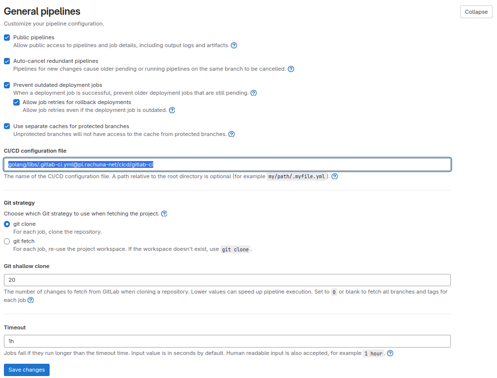

# {height=20px} Centralny proces w gitlab

Poniżej opisano, jak skonfigurować centralny proces CI/CD w GitLab oraz gdzie znaleźć najważniejsze ustawienia związane z pipeline'ami.

`Ustawienia Projektu` -> `CI/CD`-> `General pipelines`

---

