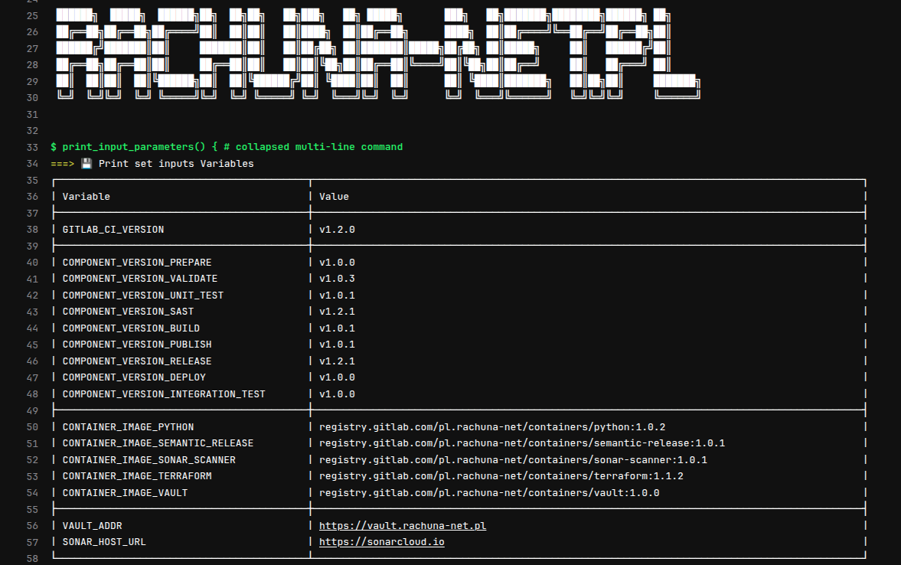

!!! note
    Komponent `print-input-parameters` umożliwia **czytelne i uporządkowane wyświetlenie wszystkich istotnych zmiennych środowiskowych**, w tym wersji komponentów CI/CD oraz obrazów kontenerowych. Jest szczególnie przydatny podczas wczesnych etapów pipeline’a (etap `prepare`) do weryfikacji, czy zmienne zostały poprawnie przekazane i rozwinięte.



---
### ⚙️ Parametry wejściowe (`inputs`)

| Nazwa          | Typ    | Domyślna wartość                                             | Opis                                              |
| -------------- | ------ | ------------------------------------------------------------ | ------------------------------------------------- |
| `docker_image` | string | `registry.gitlab.com/pl.rachuna-net/containers/python:1.0.0` | Obraz Dockera z interpreterem Pythona lub shellem |

---
### 🧬 Zmienne środowiskowe obsługiwane przez skrypt

Komponent wypisuje wartości m.in. następujących zmiennych:

* `GITLAB_CI_VERSION`
* `COMPONENT_VERSION_BUILD`
* `COMPONENT_VERSION_DEPLOY`
* `COMPONENT_VERSION_INTEGRATION_TEST`
* `COMPONENT_VERSION_PUBLISH`
* `COMPONENT_VERSION_PREPARE`
* `COMPONENT_VERSION_RELEASE`
* `COMPONENT_VERSION_SAST`
* `COMPONENT_VERSION_UNIT_TEST`
* `COMPONENT_VERSION_VALIDATE`
* `CONTAINER_IMAGE_PYTHON`
* `CONTAINER_IMAGE_SEMANTIC_RELEASE`
* `CONTAINER_IMAGE_SONAR_SCANNER`
* `CONTAINER_IMAGE_TERRAFORM`
* `CONTAINER_IMAGE_VAULT`
* `VAULT_ADDR`

---
### 📤 Output

Skrypt wypisuje dane w formie tabeli ASCII w logach pipeline’u, np.:

```
===> 💾 Print set inputs Variables
┌────────────────────────────────┬──────────────────────────────────────────────────────────────────────────────────────────────────────┐
| Variable                       | Value                                                                                               |
├────────────────────────────────┼──────────────────────────────────────────────────────────────────────────────────────────────────────┤
| CONTAINER_IMAGE_TERRAFORM      | registry.gitlab.com/pl.rachuna-net/containers/terraform:1.0.0                                       |
| COMPONENT_VERSION_DEPLOY       | v1.2.3                                                                                              |
...
└────────────────────────────────┴──────────────────────────────────────────────────────────────────────────────────────────────────────┘
```

---
### 🛠 Job: `🔍 input parameters`

* Etap: `prepare`
* Uruchamia funkcję `print_input_parameters`, która drukuje wartości
* **Nie uruchamia się automatycznie** (`rules: when: never`)

---
### 🧪 Przykład użycia

```yaml
include:
  - component: $CI_SERVER_FQDN/pl.rachuna-net/cicd/components/prepare/input_parameters@$COMPONENT_VERSION_PREPARE
    inputs:
      docker_image: $CONTAINER_IMAGE_PYTHON

🔍 input parameters:
  stage: prepare
  rules:
    - when: on_success
```