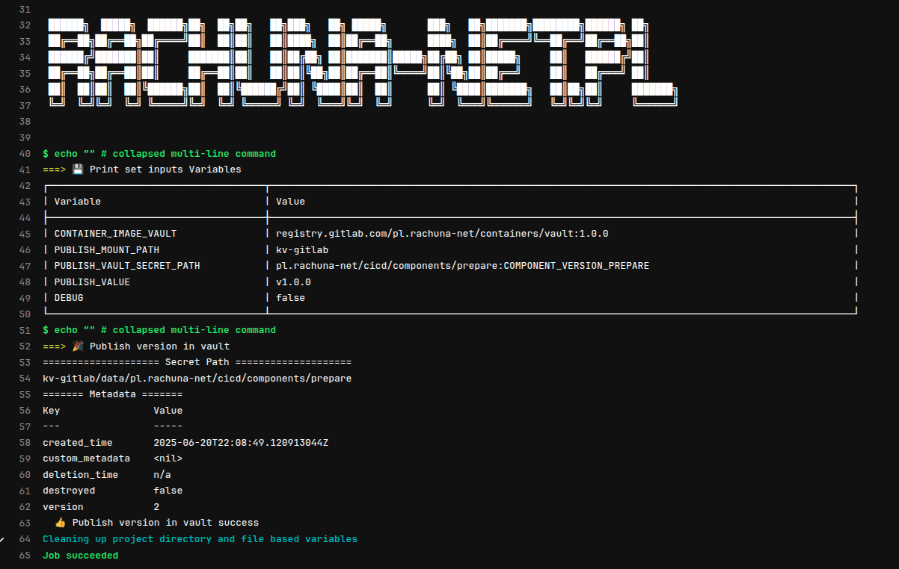

# {height=20px} Publikacja wersji jako secret w vault

!!! note
    Publikacja numeru wersji **komponentu gitlab (gitlab-components)** do **Vaulta** ma na celu umożliwienie jego dalszego, automatycznego wykorzystania w infrastrukturze CI/CD. 

    - krok 1: Po wydaniu wersji komponentu zapisywana jest jako `secret` w Vault.
    - krok 2: Terraform — działający w kontekście głównej grupy `pl.rachuna-net` — pobiera ją i zapisuje jako zmienną w gitlabowych `variables`.
    - krok 3: Następnie GitLab CI odczytuje tę zmienną i ustawia ją w dyrektywie `include`, np.:

    **Przykład wykorzystania:**
    ```yaml
    include:
      - local: _configs/_rules_validate.yml
      - component: $CI_SERVER_FQDN/pl.rachuna-net/cicd/components/validate/yaml@$COMPONENT_VERSION_VALIDATE
        inputs:
          docker_image: $CONTAINER_IMAGE_PYTHON
    ```

    Dzięki temu nowa wersja komponentu może być automatycznie użyta w pipeline'ach po jej opublikowaniu, bez konieczności ręcznej aktualizacji konfiguracji. Zapewnia to większą spójność, automatyzację i łatwiejsze zarządzanie wersjami w całym ekosystemie.



---
## Sekcja `spec.inputs`

Definiuje parametry wejściowe dla szablonu.

| Parametr                       | Domyślna wartość                                            | Opis                                               |
| ------------------------------ | ----------------------------------------------------------- | -------------------------------------------------- |
| `docker_image`                 | `registry.gitlab.com/pl.rachuna-net/containers/vault:1.0.0` | Obraz Dockera z klientem Vault                     |
| `debug`                        | `"false"`                                                   | Flaga debugowania                                  |
| `publish_mount_path`           | `"kv-gitlab"`                                               | Mount point (path) w Vault (np. KV v2)             |
| `publish_vault_secret_path`    | `""`                                                        | Ścieżka do secreta w Vault, w formacie `path:key`  |
| `publish_value_variables_name` | `APPLICATION_VERSION`                                       | Nazwa zmiennej, której wartość ma być opublikowana |

---
## Sekcja `variables`

Ustawia zmienne środowiskowe używane w szablonie na podstawie wartości `spec.inputs`.

| Zmienna                              | Źródło                                |
| ------------------------------------ | ------------------------------------- |
| `CONTAINER_IMAGE_VAULT`              | `inputs.docker_image`                 |
| `PUBLISH_MOUNT_PATH`                 | `inputs.publish_mount_path`           |
| `PUBLISH_VAULT_SECRET_PATH`          | `inputs.publish_vault_secret_path`    |
| `PUBLISH_VAULT_VALUE_VARIABLES_NAME` | `inputs.publish_value_variables_name` |
| `DEBUG`                              | `inputs.debug`                        |

---
## Opis działania

Ten blok jest głównym szablonem wykonawczym. Uruchamia skrypt w kontenerze Vaulta.

```bash
IFS=":" read -r path secret <<< "$PUBLISH_VAULT_SECRET_PATH"
vault kv patch -mount=$PUBLISH_MOUNT_PATH $path $secret="${!PUBLISH_VAULT_VALUE_VARIABLES_NAME}"
```

– rozdziela `pl.rachuna-net:GITLAB-CI` na:

* `path = pl.rachuna-net`
* `secret = GITLAB-CI`

– wykonuje publikację (`vault kv patch`):

!!! warning
    `${!PUBLISH_VAULT_VALUE_VARIABLES_NAME}` = **nie wartość literalna**, tylko **wartość zmiennej o nazwie podanej jako string**

---
## 🔧 Wymagania

* Vault mount typu `kv` (v2) pod `kv-gitlab`
* Token Vaulta (przez zmienną `VAULT_TOKEN`) z policy zawierającą:

```hcl
path "sys/internal/ui/mounts/*" {
  capabilities = ["read"]
}
path "kv-gitlab/data/*" {
  capabilities = ["create", "read", "update", "patch"]
}
path "kv-gitlab/metadata/*" {
  capabilities = ["read", "list"]
}
```

---

### 📦 Przykład użycia

W `.gitlab-ci.yml` projektu:

```yaml
include:
  - component: $CI_SERVER_FQDN/pl.rachuna-net/cicd/components/release/vault@$COMPONENT_VERSION_RELEASE
    inputs:
      docker_image: $CONTAINER_IMAGE_VAULT

variables:
  RELEASE_CANDIDATE_VERSION: "1.0.0-abc123"

🎉 Publish version in vault:
  stage: release
  needs:
    - job: 🕵 Set Version
    - job: 🌐 publish docker image
      optional: true
  variables:
    PUBLISH_VAULT_VALUE_VARIABLES_NAME: "$PUBLISH_VAULT_VALUE_VARIABLE"
  rules: !reference [.rule:release:vault, rules]
```

---

## 🧪 Wynik działania

W Vault zostanie zapisany:

* pod: `kv-gitlab/pl.rachuna-net`
* klucz: `GITLAB-CI`
* wartość: `"1.0.0-abc123"`