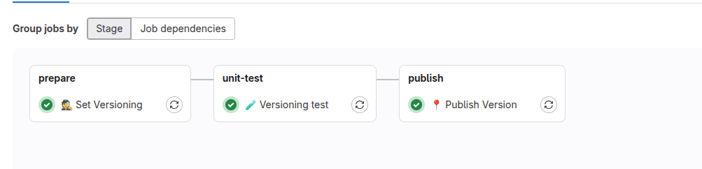

# {height=20px} Wersjonowania kodu

!!! tips
    **SemVer (Semantic Versioning)**[^1] to standard wersjonowania oprogramowania, który określa sposób nadawania numerów wersji w formacie **MAJOR.MINOR.PATCH**.  

    ### Struktura:
    - **MAJOR** – Zwiększane, gdy wprowadzane są zmiany niekompatybilne wstecz.  
    - **MINOR** – Zwiększane, gdy dodawane są nowe funkcje, ale zachowana jest kompatybilność wsteczna.  
    - **PATCH** – Zwiększane, gdy poprawiane są błędy bez zmiany funkcjonalności.  

    Dodatkowo można stosować oznaczenia:
    - **Pre-release** (np. `1.2.0-alpha.1`) – wersje testowe przed oficjalnym wydaniem.
    - **Build metadata** (np. `1.2.0+build201`) – informacje o kompilacji.

    SemVer pomaga w zarządzaniu zależnościami i ułatwia utrzymanie kompatybilności kodu.

### Krok 1. Przygotowanie obrazu kontenerowego

Przygotowany obraz kontenerowy z semantic-release[^2] 
[commit](https://gitlab.com/pl.rachuna-net/containers/semantic-release/-/blob/7fa2f283201ba7c8dcd72d8170f146c3b301a497/Dockerfile)

Ręczne wydanie obrazu
```bash
 docker build -t registry.gitlab.com/pl.rachuna-net/containers/semantic-release:0.0.1 .
 docker push registry.gitlab.com/pl.rachuna-net/containers/semantic-release:0.0.1
```

### Krok 2. Przygotowanie komponentu do wersjonowania kodu
[pl.rachuna-net/cicd/components/release](https://gitlab.com/pl.rachuna-net/cicd/components/release/-/blob/main/templates/semantic-release.yml?ref_type=heads)

- Krok 1. Pobieranie konfiguracji `.releaserc.js`
```bash
      if [ ! -f "$CI_PROJECT_DIR/.releaserc" ]; then
        curl -s -H "PRIVATE-TOKEN: ${GITLAB_TOKEN}" ${VERSIONING_RELEASERC_URL} --output $CI_PROJECT_DIR/.releaserc.js;
      fi
```
- Krok 2. Uruchomienie semantic-release

---
### Przykładowe użycie w `.gitlab-ci.yml`

```yml
default:
  tags:
    - onprem

include:
  - component: $CI_SERVER_FQDN/pl.rachuna-net/cicd/components/release/semantic-release@main

stages:
  - prepare
  - publish

# Ustawia wersje, ale proces nie zakłada jeszcze obiektów w gitlab
🕵 Set Version:
  stage: prepare
  variables:
    VERSIONING_DRY_RUN: "true"
  extends: ['.versioning:base']

📍 Publish Version:
  stage: publish
  extends: ['.versioning:base']
```


[^1]: Źródło: https://semantic-release.gitbook.io/semantic-release
[^2]: Źródło: https://semver.org/
