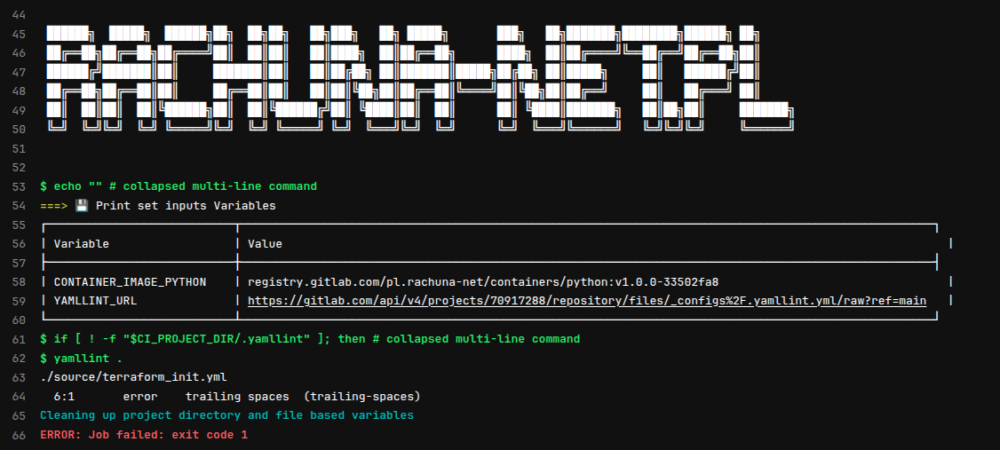

!!! note
    Ten komponent służy do statycznej analizy plików YAML w repozytorium z wykorzystaniem narzędzia [`yamllint`](https://yamllint.readthedocs.io/). Automatycznie pobiera plik konfiguracyjny `.yamllint` zdefiniowany przez użytkownika, o ile nie jest obecny w repozytorium.



Przykład włączenia komponentu:

```yaml
include:
  component: registry.gitlab.com/your-group/gitlab-components/yaml-lint
```

---
## ⚙️ Parametry wejściowe (`inputs`)

| Nazwa          | Typ    | Domyślna wartość                                                                                     | Opis                                                              |
| -------------- | ------ | ---------------------------------------------------------------------------------------------------- | ----------------------------------------------------------------- |
| `docker_image` | string | `registry.gitlab.com/pl.rachuna-net/containers/python:1.0.0`                                         | Obraz Dockera zawierający `yamllint`                              |
| `yamllint_url` | string | `https://gitlab.com/api/v4/projects/70917288/repository/files/_configs%2F.yamllint.yml/raw?ref=main` | URL do pliku `.yamllint`, pobieranego jeśli nie istnieje lokalnie |

---
## 🧬 Zmienne środowiskowe

| Nazwa zmiennej           | Wartość                      |
| ------------------------ | ---------------------------- |
| `CONTAINER_IMAGE_PYTHON` | `$[[ inputs.docker_image ]]` |
| `YAMLLINT_URL`           | `$[[ inputs.yamllint_url ]]` |

---
## 🧱 Zależności

* Pliki lokalne:

  * `/source/logo.yml` – do wyświetlenia loga komponentu
  * `/source/input_variables_yaml.yml` – do ustawienia zmiennych input

* Wymaga zmiennej `GITLAB_TOKEN` do pobrania pliku `.yamllint` przez API GitLab

---
## 🚀 Job: `🕵 YAML lint`

Ten job:

1. Ustawia konfigurację `yamllint` (lokalną lub zdalną z GitLaba).
2. Uruchamia `yamllint` na całym repozytorium.

```bash
if [ ! -f "$CI_PROJECT_DIR/.yamllint" ]; then
  curl -s -H "PRIVATE-TOKEN: ${GITLAB_TOKEN}" ${YAMLLINT_URL} --output $CI_PROJECT_DIR/.yamllint;
fi
yamllint .
```

!!! warning
    Jeśli plik `.yamllint` już istnieje w repozytorium, nie zostanie nadpisany.

---
## 🧪 Przykład użycia z niestandardowym configiem

```yaml
include:
  - local: _rules/validate.yml
  - component: $CI_SERVER_FQDN/pl.rachuna-net/cicd/components/validate/yaml@$COMPONENT_VERSION_VALIDATE
    inputs:
      docker_image: $CONTAINER_IMAGE_PYTHON


🕵 YAML lint:
  stage: validate
  rules: !reference [.rule:validate:yamllint, rules]
```