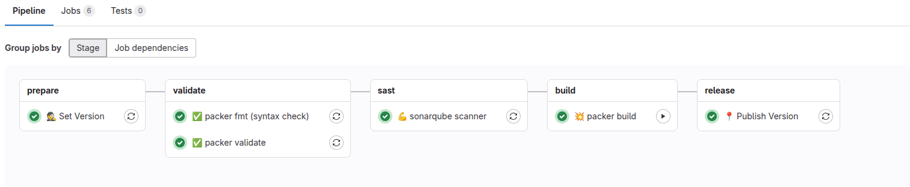

# {width=20px} Packer

Proces budowania obrazów maszyn wirtualnych z użyciem **Packer** został zautomatyzowany w pipeline CI/CD GitLab. Dzięki temu tworzenie, testowanie i publikacja nowych wersji obrazów odbywa się szybko, powtarzalnie i bezpiecznie.

---
## Gitlab-ci pipeline

* **stage - prepare**
    * **👷 Set Version** -
      Ustawienie wersji budowanego artefaktu na podstawie convenctional commits
* **stage - validate**
    * **☑️ packer fmt (syntax check)** -
      Sprawdzenie formatowania plików konfiguracyjnych Packer (`.json` lub `.hcl`). Upewnia się, że składnia jest poprawna i zgodna z konwencją.
    * **☑️ packer validate** -
      Walidacja logiczna – sprawdza, czy pliki konfiguracyjne zawierają poprawne definicje i referencje.
* **stage - sast**
    * **💪 sonarqube scanner** -
      Wykonywana jest analiza statyczna kodu za pomocą SonarQube.
* **stage - build**
    * **💥 packer build** -
      Właściwe uruchomienie polecenia `packer build`. Budowany jest obraz maszyny wirtualnej dla Proxmox
* **stage - release**
    * **📍 Publish Version** -
      Zatwierdzenie i publikacja wersji (np. dodanie tagu Git, zapisanie metadanych, aktualizacja zewnętrznego rejestru lub katalogu obrazów).
