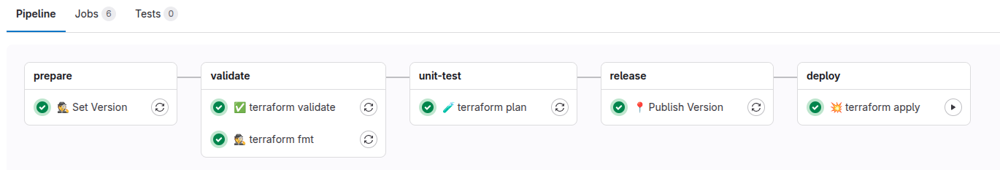
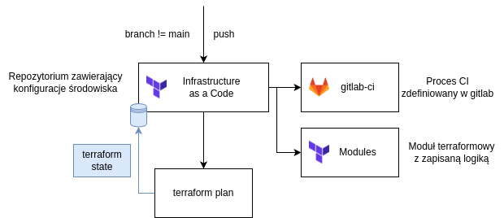
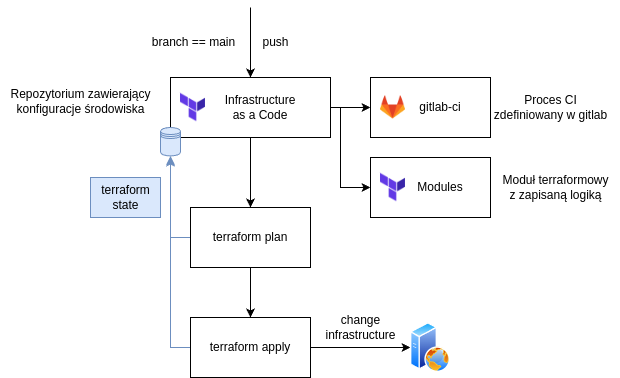

# {width=20px} Terraform

Proces zarządzania infrastrukturą z użyciem **Terraform** został zautomatyzowany w pipeline CI/CD GitLab. Dzięki temu planowanie, testowanie i wdrażanie zmian w infrastrukturze odbywa się szybko, powtarzalnie i bezpiecznie.

---
## Gitlab-ci pipeline

* **stage  - prepare**
    * **👷 Set Version** - 
        Ustawienie wersji budowanego artefaktu na podstawie convenctional commits
*  **stage  - validate**
      * **☑️ terraform fmt** -
        Sprawdzenie formatowania plików konfiguracyjnych Terraform (`.tf`). Upewnia się, że składnia jest poprawna i zgodna z konwencją.
    * **☑️ terraform validate** - 
        Walidacja logiczna – sprawdza, czy pliki konfiguracyjne zawierają poprawne definicje i referencje.
*  **stage  - unit-test**
    * **🔍 terraform plan** -
        Generowanie planu zmian na podstawie aktualnego stanu infrastruktury i konfiguracji. Pozwala zweryfikować, jakie zmiany zostaną wprowadzone.
*  **stage  - sast**
    * **💪 sonarqube scanner** - 
        Wykonywana jest analiza statyczna kodu za pomocą SonarQube.
*  **stage  - release**
    * **📍 Publish Version** - 
        Zatwierdzenie i publikacja wersji (np. dodanie tagu Git, zapisanie metadanych, aktualizacja zewnętrznego rejestru lub katalogu obrazów).
*  **stage  - deploy**
    * **🚀 terraform apply** - 
        Wdrażanie zatwierdzonych zmian w infrastrukturze na podstawie wygenerowanego planu. Zaktualizowany stan Terraform zostaje zapisany w GitLab.

---
## Terraform plan - validation & test

!!! Question inline "Jak to działa?"
    1. 🤖 **GitLab-ci**, wykonuje polecenie `terraform plan`.
    2. Następuje weryfikacja z stanem **terraform state**. 
    3. Wyświetlone zostaną zmiany

**Ideowy opis flow procesu terraform plan**

---
## Terraform apply - deploy

!!! Question inline "Jak to działa?"
    1. 🤖 **GitLab-ci**, wykonuje polecenie `terraform plan`. 
    2. 🤖 **GitLab-ci**, wykonuje polecenie `terraform apply`, wdrażając zmiany w infrastrukturze. 
    3. 🥳 Zaktualizowany stan Terraform zostaje zapisany w GitLab.

