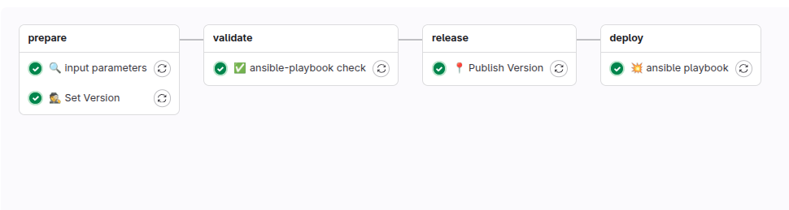

# {width=20px} Ansible Playbooks

Ansible Playbook służy do automatyzacji zarządzania systemami i wdrażania aplikacji. Playbooki są napisane w formacie YAML i zawierają zestaw instrukcji, zwanych "play", które definiują, jakie zadania mają być wykonane na określonych grupach hostów. Dzięki playbookom można zautomatyzować różnorodne procesy, takie jak instalacja oprogramowania, konfiguracja systemów, zarządzanie użytkownikami czy wdrażanie aplikacji w chmurze. Umożliwiają one również łatwe powtarzanie zadań oraz zapewniają spójność i kontrolę nad środowiskiem IT.

--- 
## Gitlab-ci pipeline

* **stage - prepare**
    * **👷 Set Version** -
      Ustawienie wersji budowanego artefaktu na podstawie convenctional commits
* **stage - validate**
    * **🕵 YAML lint** -
      Sprawdzenie formatowania plików konfiguracyjnych (`.yml` lub `.yaml`). Upewnia się, że składnia jest poprawna i zgodna z konwencją.
    * **✅ ansible-playbook check** - 
      Polecenie `ansible-playbook --check` uruchamia playbook w trybie symulacji, pozwalając zobaczyć, jakie zmiany byłyby wprowadzone na zdalnych systemach bez ich faktycznego modyfikowania.
* **stage - release**
    * **📍 Publish Version** -
      Zatwierdzenie i publikacja wersji (np. dodanie tagu Git, zapisanie metadanych, aktualizacja zewnętrznego rejestru lub katalogu obrazów).
*  **stage  - deploy**
    * **💥 ansible playbook** - 
        Wdrażanie zatwierdzonych zmian w infrastrukturze za pomocą Ansible Playbook przy użyciu odpowiedniego inventory.