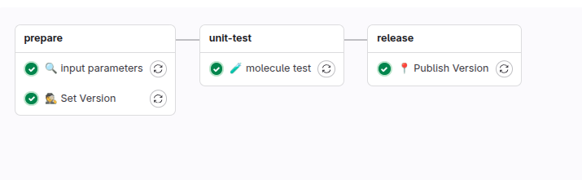

# {width=20px} Ansible Role

Rola Ansible to uporządkowany sposób grupowania zadań, zmiennych, szablonów i plików, które razem realizują określoną funkcję konfiguracyjną lub instalacyjną. Ten projekt wykorzystuje rolę Ansible do automatyzacji wybranego elementu infrastruktury, a załączony pipeline CI odpowiada za jej testowanie i wersjonowanie, zapewniając jakość i spójność wdrożeń.

--- 
## Gitlab-ci pipeline

* **stage - prepare**
    * **👷 Set Version** -
      Ustawienie wersji budowanego artefaktu na podstawie convenctional commits
* **stage - validate**
    * **🕵 YAML lint** -
      Sprawdzenie formatowania plików konfiguracyjnych (`.yml` lub `.yaml`). Upewnia się, że składnia jest poprawna i zgodna z konwencją.
* **stage - unit-test**
    * **🧪 molecule test** -
      Molecule test to automatyczny test integracyjny roli Ansible, który weryfikuje, czy rola działa poprawnie w symulowanym środowisku
* **stage - release**
    * **📍 Publish Version** -
      Zatwierdzenie i publikacja wersji (np. dodanie tagu Git, zapisanie metadanych, aktualizacja zewnętrznego rejestru lub katalogu obrazów).
