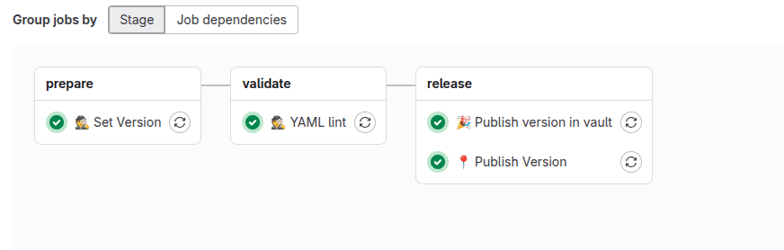

# {width=20px} Defaultowy proces CI

Domyślny proces CI w GitLab automatyzuje budowanie, testowanie i wdrażanie aplikacji na podstawie zdefiniowanych etapów w pliku `.gitlab-ci.yml`. Dzięki temu każda zmiana wprowadzona do repozytorium przechodzi przez powtarzalny i kontrolowany cykl weryfikacji, co zwiększa jakość oraz bezpieczeństwo wdrażanego oprogramowania.

---
## Gitlab-ci pipeline

* **stage - prepare**
    * **👷 Set Version** -
      Ustawienie wersji budowanego artefaktu na podstawie convenctional commits
* **stage - validate**
    * **🕵 YAML lint** -
      Sprawdzenie formatowania plików konfiguracyjnych (`.yml` lub `.yaml`). Upewnia się, że składnia jest poprawna i zgodna z konwencją.
* **stage - sast**
    * **💪 sonarqube scanner** -
      Wykonywana jest analiza statyczna kodu za pomocą SonarQube.
* **stage - release**
    * **📍 Publish Version** -
      Zatwierdzenie i publikacja wersji (np. dodanie tagu Git, zapisanie metadanych, aktualizacja zewnętrznego rejestru lub katalogu obrazów).
    * **🎉 Publish version in vault** -
      Pulikuje wersję jako secret vault do ponownego reużycia przez proces gitlab-ci
