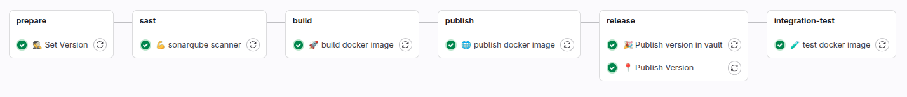

# {width=20px} docker

Proces CI/CD w GitLab umożliwia automatyczne budowanie oraz publikację obrazu Dockerowego na podstawie zmian wprowadzonych do repozytorium. Dzięki wykorzystaniu modularnych komponentów pipeline, każda wersja aplikacji przechodzi przez spójny i powtarzalny proces obejmujący budowanie obrazu, weryfikację jego poprawności oraz publikację do rejestru (np. GitLab Container Registry).

---
## Gitlab-ci pipeline

* **stage - prepare**
    * **👷 Set Version** -
      Ustawienie wersji budowanego artefaktu na podstawie convenctional commits
* **stage - sast**
    * **💪 sonarqube scanner** -
      Wykonywana jest analiza statyczna kodu za pomocą SonarQube.
* **stage - build**
    * **🚀 build docker image** -
        Wykonywana jest kompilacja obrazu dockerowego
* **stage - publish**
    * **🌐 publish docker image** -
        Wykonywana jest zbudowanego obrazu kontenerowego
* **stage - release**
    * **📍 Publish Version** -
      Zatwierdzenie i publikacja wersji (np. dodanie tagu Git, zapisanie metadanych, aktualizacja zewnętrznego rejestru lub katalogu obrazów).
    * **🎉 Publish version in vault** -
      Pulikuje wersję jako secret vault do ponownego reużycia przez proces gitlab-ci
* **stage - integration-rest**
    * **🧪 test docker image** - 
        Wykonywane są proste smoke testy potwierdzające, że kontener działa prawidłowo
