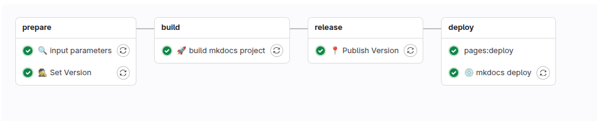

# {width=20px} mkdocs

Proces CI/CD w GitLab automatyzuje budowanie oraz publikację dokumentacji technicznej opartej na **MkDocs**. Pipeline składa się z czterech głównych etapów: przygotowania, budowania, publikacji wersji oraz wdrożenia. Dzięki temu każda aktualizacja dokumentacji jest przetwarzana w sposób spójny, wersjonowany i bezpiecznie wdrażana przez GitLab Pages.

---

## Gitlab-ci pipeline

* **stage - prepare**
    * **🔍 input parameters** –  
      Walidacja oraz pobranie parametrów wejściowych dla procesu budowania dokumentacji.
    * **🙋 Set Version** –  
      Ustawienie wersji dokumentacji na podstawie konwencji commitów (Conventional Commits).

* **stage - build**
    * **🚀 build mkdocs project** –  
      Kompilacja projektu dokumentacji z wykorzystaniem frameworka MkDocs i wybranych rozszerzeń (np. `material`, `mkdocs-versioning`).

* **stage - release**
    * **📍 Publish Version** –  
      Publikacja wersji dokumentacji — może obejmować dodanie tagu Git, zapis metadanych lub przygotowanie paczki do dalszej dystrybucji.

* **stage - deploy**
    * **📄 pages:deploy** –  
      Wdrożenie statycznej wersji dokumentacji do GitLab Pages.
    * **🌐 mkdocs deploy** –  
      Alternatywny lub uzupełniający mechanizm wdrożeniowy – np. z wykorzystaniem `mkdocs gh-deploy` lub niestandardowych skryptów deploymentu.

---

Pipeline umożliwia sprawne zarządzanie wersjami dokumentacji oraz zapewnia spójne i powtarzalne publikowanie każdej zmiany w przyjaznej formie dostępnej przez przeglądarkę.
