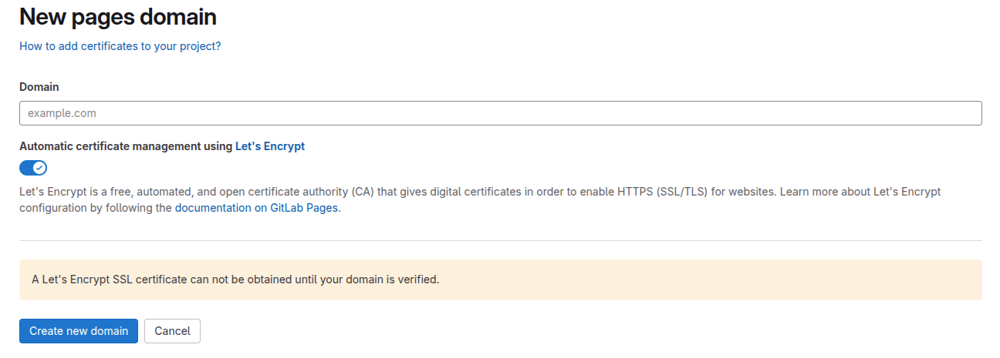

# {height=20px} Gitlab pages - ustawienie pages na domenie `rachuna-net.pl`

!!! tip
    Celem niniejszego dokumentu jest przedstawienie kompletnego procesu uruchomienia strony internetowej opartej na MkDocs za pomocą GitLab Pages oraz podłączenia jej do własnej domeny, np. docs.rachuna-net.pl lub rachuna-net.pl.

---
## Wymagania
* GitLab repository z plikami MkDocs (mkdocs.yml, katalog docs/)
* Plik .gitlab-ci.yml definiujący proces budowy i publikacji strony
* Dostęp do panelu zarządzania DNS dla domeny rachuna-net.pl

---
## 1. Przygotowanie repozytorium MkDocs

1. Zainicjalizuj projekt MkDocs (jeśli jeszcze nie istnieje):

   ```bash
   mkdocs new my-project
   cd my-project
   ```

2. Dodaj plik `.gitlab-ci.yml` do repozytorium:

   ```yaml
   image: python:3.11

   pages:
     script:
       - pip install mkdocs
       - mkdocs build
       - mv site public
     artifacts:
       paths:
         - public
     only:
       - main
   ```

3. Wypchnij zmiany do GitLaba:

   ```bash
   git add .
   git commit -m "Init MkDocs site"
   git push origin main
   ```

4. Po chwili strona powinna być dostępna pod adresem domyślnym:

   ```
   https://<nazwa-użytkownika>.gitlab.io/<nazwa-repozytorium>
   ```

## 2. Podłączenie subdomeny `docs.rachuna-net.pl`

1. Przejdź do repozytorium → **Settings** → **Pages** → kliknij `New Domain`

   

2. Dodaj domenę `docs.rachuna-net.pl`

3. GitLab wygeneruje dwa rekordy DNS:

   * `ALIAS`:

     ```
     docs.rachuna-net.pl.  ALIAS  pl.rachuna-net.gitlab.io.
     ```

   * `TXT`:

     ```
     _gitlab-pages-verification-code.docs.rachuna-net.pl.  TXT  gitlab-pages-verification-code=<wygenerowany_kod>
     ```

4. Wprowadź powyższe rekordy do strefy DNS domeny.

5. GitLab automatycznie zweryfikuje rekordy i wygeneruje certyfikat SSL (Let's Encrypt)

---
1. Wystaw swoją aplikacje na gitlab-pages
    * - [x] https://docs-7c5e90.gitlab.io
2. W ustawieniach pages wybierz `Deploy` :octicons-arrow-right-24: `page` :octicons-arrow-right-24: `new domain`
:   {height=300px}

    Po wypełnieniu formularza otrzymasz wpisy do rekordów DNS

    * - [x] docs.rachuna-net.pl ALIAS pl.rachuna-net.gitlab.io.
    * - [x] _gitlab-pages-verification-code.docs.rachuna-net.pl TXT gitlab-pages-verification-code=XYZ

3. Czekamy na aktualizację domeny
4. Czekamy na utworzenie Certyfikatu SSL z [Let's Encrypt](https://letsencrypt.org/)

## 3. Podłączenie domeny głównej `rachuna-net.pl`

!!! tip
    Na podstawie instrukcji [docs.gitlab :octicons-arrow-right-24: custom domains](https://docs.gitlab.com/ee/user/project/pages/custom_domains_ssl_tls_certification/index.html#for-root-domains)

Dla domen głównych nie można użyć `ALIAS/CNAME`, należy użyć rekordu `A`.

1. W ustawieniach Pages → `New Domain` → dodaj `rachuna-net.pl`

2. Skonfiguruj DNS:

   ```txt
   rachuna-net.pl.                                  A     35.185.44.232
   _gitlab-pages-verification-code.rachuna-net.pl.  TXT   gitlab-pages-verification-code=<kod>
   ```

3. Po propagacji DNS i weryfikacji – certyfikat SSL zostanie wystawiony automatycznie.


---
## 4. Efekt końcowy

Po wykonaniu powyższych kroków, strona MkDocs będzie dostępna pod Twoją własną domeną z certyfikatem SSL, np.:

```
https://docs.rachuna-net.pl
```

---
## Przydatne linki

* [MkDocs – Dokumentacja](https://www.mkdocs.org/)
* [GitLab Pages – Custom Domains](https://docs.gitlab.com/ee/user/project/pages/custom_domains_ssl_tls_certification/)
* [Let's Encrypt](https://letsencrypt.org/)