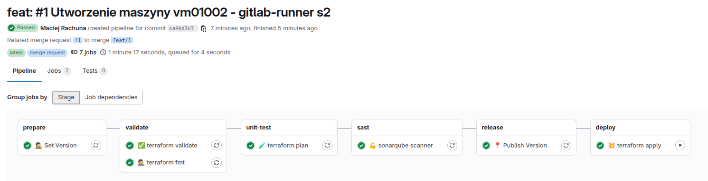

# {width=20px} Tworzenie maszyny wirtualnej na Proxmox za pomocą Terraform

## Wprowadzenie

Niniejsza sekcja dokumentacji opisuje proces tworzenia maszyn wirtualnych na platformie Proxmox przy użyciu Terraform. Prezentowane podejście umożliwia automatyczne zarządzanie infrastrukturą w duchu **Infrastructure as Code (IaC)**.

!!! tips "Korzyści wynikające z użycia Terraform"

    Terraform pozwala na:

    - **Automatyzację** tworzenia i zarządzania maszynami wirtualnymi w Proxmoxie,  
    - **Wersjonowanie konfiguracji**, co ułatwia śledzenie i audyt zmian,  
    - **Powtarzalność wdrożeń**, co minimalizuje ryzyko błędów manualnych i zwiększa spójność środowisk.

---

## Definiowanie grupy w Terraform

Aby utworzyć maszynę wirtualną, należy dodać odpowiednią definicję do pliku konfiguracyjnego Terraform. 

**Repozytorium IaC Proxmox**  
🔗 [GitLab: pl.rachuna-net/infrastructure/terraform/iac-proxmox](https://gitlab.com/pl.rachuna-net/infrastructure/terraform/iac-proxmox)


###  Przykładowy plik konfiguracyjny Terraform

📄 **Ścieżka pliku:** `virtual_machines/vm01002.tf`

```hcl
module "vm01002" {
  source = "git@gitlab.com:pl.rachuna-net/infrastructure/terraform/modules/proxmox-vm.git?ref=V1.0.0"

  hostname      = "vm01002"
  description   = "gitlab-runner s2"
  node_name     = "pve-s2"
  tags          = ["gitlab-runner", "ubuntu"]
  pool_id       = "gitlab-runner"
  vm_id         = 1002
  is_production = false
  protection    = true

  template = {
    node_name = "pve-s1"
    vm_id     = 100
  }

  memory = {
    dedicated = 2048
    floating  = 2048
  }

  cpu = {
    cores   = 2
    sockets = 1
    type    = "host"
  }

  technical_user = {
    username    = "tech_admin"
    ssh_pub_key = var.technical_user_ssh_pub_key
  }

}
```
Konfiguracja skryptu, do manualnego uruchomienia
```bash
export CI_SERVER_URL="https://gitlab.com"
export CI_PROJECT_ID="******"
export CI_USERNAME="******"
export CI_JOB_TOKEN="******"

export TF_STATE_NAME="default"
export TF_VAR_proxmox_endpoint="https://pve:8006/"
export TF_VAR_proxmox_username="root@pam"
export TF_VAR_proxmox_password="******"
export TF_VAR_proxmox_insecure="true"
export TF_VAR_technical_user_ssh_pub_key="******"

terraform init \
  -backend-config="address=${CI_SERVER_URL}/api/v4/projects/${CI_PROJECT_ID}/terraform/state/${TF_STATE_NAME}" \
  -backend-config="lock_address=${CI_SERVER_URL}/api/v4/projects/${CI_PROJECT_ID}/terraform/state/${TF_STATE_NAME}/lock" \
  -backend-config="unlock_address=${CI_SERVER_URL}/api/v4/projects/${CI_PROJECT_ID}/terraform/state/${TF_STATE_NAME}/lock" \
  -backend-config="username=${CI_USERNAME}" \
  -backend-config="password=${CI_JOB_TOKEN}" \
  -backend-config="lock_method=POST" \
  -backend-config="unlock_method=DELETE" \
  -backend-config="retry_wait_min=5"

terraform plan
terraform apply -auto-approve
```

## Weryfikacja planu Terraform

Po zapisaniu konfiguracji należy uruchomić polecenie `terraform plan`, które zwróci listę planowanych zmian:

```bash
$ terraform apply -auto-approve
Acquiring state lock. This may take a few moments...
module.virtual_machines.module.vm01002.random_password.vm: Refreshing state... [id=none]
Terraform used the selected providers to generate the following execution
plan. Resource actions are indicated with the following symbols:
  + create
Terraform will perform the following actions:
  # module.virtual_machines.module.vm01002.proxmox_virtual_environment_vm.vm will be created
  + resource "proxmox_virtual_environment_vm" "vm" {
      + acpi                    = true
      + bios                    = "seabios"
      + description             = "gitlab-runner s2"
      + id                      = (known after apply)
      + ipv4_addresses          = (known after apply)
      + ipv6_addresses          = (known after apply)
      + keyboard_layout         = "en-us"
      + mac_addresses           = (known after apply)
      + migrate                 = false
      + name                    = "vm01002"
      + network_interface_names = (known after apply)
      + node_name               = "pve-s2"
      + on_boot                 = true
      + pool_id                 = "gitlab-runner"
      + protection              = true
      + reboot                  = false
      + reboot_after_update     = true
      + scsi_hardware           = "virtio-scsi-pci"
      + started                 = true
      + stop_on_destroy         = false
      + tablet_device           = true
      + tags                    = [
          + "gitlab-runner",
          + "alpine-3",
        ]
      + template                = false
      + timeout_clone           = 1800
      + timeout_create          = 1800
      + timeout_migrate         = 1800
      + timeout_move_disk       = 1800
      + timeout_reboot          = 1800
      + timeout_shutdown_vm     = 1800
      + timeout_start_vm        = 1800
      + timeout_stop_vm         = 300
      + vm_id                   = 1002
      + agent {
          + enabled = true
          + timeout = "15m"
          + trim    = false
          + type    = "virtio"
        }
      + clone {
          + full      = true
          + node_name = "pve-s1"
          + retries   = 1
          + vm_id     = 101
        }
      + cpu {
          + cores      = 2
          + hotplugged = 0
          + limit      = 0
          + numa       = false
          + sockets    = 1
          + type       = "host"
          + units      = 1024
        }
      + initialization {
          + datastore_id = "local-lvm"
          + upgrade      = (known after apply)
          + ip_config {
              + ipv4 {
                  + address = "dhcp"
                }
            }
          + user_account {
              + keys     = [
                  + (sensitive value),
                ]
              + password = (sensitive value)
              + username = "tech_admin"
            }
        }
      + memory {
          + dedicated      = 2048
          + floating       = 2048
          + keep_hugepages = false
          + shared         = 0
        }
      + network_device {
          + bridge      = "vmbr0"
          + enabled     = true
          + firewall    = false
          + mac_address = (known after apply)
          + model       = "virtio"
          + mtu         = 0
          + queues      = 0
          + rate_limit  = 0
          + vlan_id     = 10
        }
      + operating_system {
          + type = "l26"
        }
    }
Plan: 1 to add, 0 to change, 0 to destroy.
```

## Wdrożenie zmian

Jeśli planowane zmiany są zgodne z oczekiwaniami, należy wdrożyć je do **`main`** poprzez **Merge Request (MR)**, co spowoduje utworzenie wirtualnej maszyny.

## Podsumowanie

Tworzenie maszyn wirtualnych za pomocą Terraform zapewnia automatyzację, powtarzalność i centralizację zarządzania. Po poprawnym wykonaniu opisanych kroków, nowa maszyna wirtualna będzie gotowa do użytku.



🚀 **Gotowe!** Nowa maszyna wirtualna została pomyślnie utworzona przy użyciu Terraform. 🎉