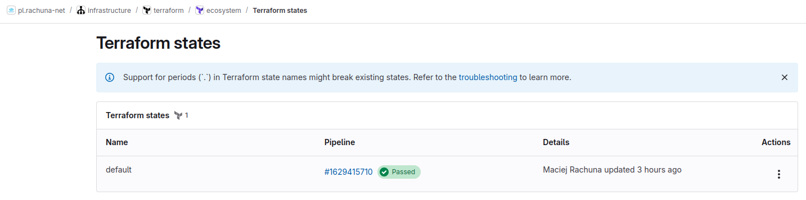

# {width=20px} Integracja z projektem gitlab

!!! note
    **Terraform State**[^1] to mechanizm w Terraformie, który przechowuje aktualny stan zarządzanej infrastruktury. Jest to plik (domyślnie `terraform.tfstate`), w którym Terraform zapisuje informacje o zasobach, ich konfiguracji oraz zależnościach. Dzięki temu Terraform może:  

    1. **Śledzić zmiany** – porównuje aktualną infrastrukturę ze skonfigurowaną w kodzie, identyfikując różnice.  
    2. **Optymalizować działania** – wie, które zasoby wymagają zmiany, zamiast tworzyć je od nowa.  
    3. **Zarządzać zależnościami** – rozumie, w jakiej kolejności tworzyć, aktualizować lub usuwać zasoby.  
    4. **Współdzielić stan** – umożliwia pracę zespołową poprzez zdalne przechowywanie stanu w backendach takich jak S3, GitLab czy Terraform Cloud.  

    Zarządzanie stanem jest kluczowe, dlatego warto używać **zdalnego backendu** zamiast przechowywać `terraform.tfstate` lokalnie, szczególnie w środowiskach zespołowych.

## Ustawienie terraform state w ustawieniach repozytorium

!!! danger inline
    Nigdy umieszczaj terraform state w ^^bezpośrednio^^ w repozytorium kodu

```bash
  terraform init \
  -backend-config="address=${CI_SERVER_URL}/api/v4/projects/${CI_PROJECT_ID}/terraform/state/${TF_STATE_NAME}" \
  -backend-config="lock_address=${CI_SERVER_URL}/api/v4/projects/${CI_PROJECT_ID}/terraform/state/${TF_STATE_NAME}/lock" \
  -backend-config="unlock_address=${CI_SERVER_URL}/api/v4/projects/${CI_PROJECT_ID}/terraform/state/${TF_STATE_NAME}/lock" \
  -backend-config="username=gitlab-ci-token" \
  -backend-config="password=${CI_JOB_TOKEN}" \
  -backend-config="lock_method=POST" \
  -backend-config="unlock_method=DELETE" \
  -backend-config="retry_wait_min=5"
```

gdzie:

- CI_PROJECT_ID - id projektu w gitlab
- CI_SERVER_URL - serwer URL
- TF_STATE_NAME - nazwa instancji state

## Terraform state z procesu CI[^2]



[^1]: https://developer.hashicorp.com/terraform/language/state
[^2]: https://docs.gitlab.com/ee/user/infrastructure/iac/terraform_state.html